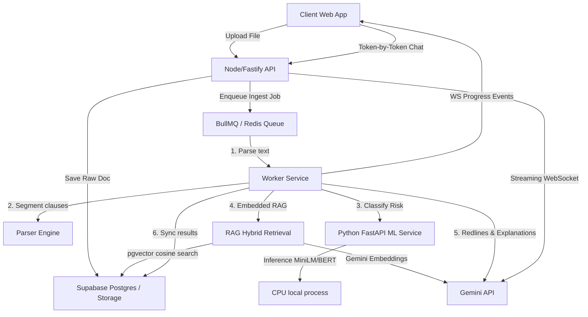

# AuditMind Architecture & Ingestion Dataflow

This document outlines the core structural components and flow of information within the AuditMind platform.

---

## 1. Architectural Blueprint

---

## 2. Ingestion Pipeline Stages

When a legal document is submitted, it travels through a 5-step pipelined job:
1. **Extraction:**
   - Node API inspects MIME types.
   - For PDFs, `pdf-parse` reads text blocks.
   - For Word documents (`.docx`), `mammoth` extracts clean raw paragraphs.
2. **Segmentation:**
   - The document is parsed line-by-line using a regex segmenter.
   - Identifies section prefixes (e.g. `Section 4.1`, `Article II`, `10.5`).
   - Grouping paragraphs into sub-clauses. If unstructured, chunks into paragraphs.
3. **Deep Learning Classification:**
   - Segmented clauses are forwarded to the Python ML microservice `/classify-clause` endpoint.
   - Local PyTorch evaluates clause risk sentiment using a sentence transformer (`cross-encoder/ms-marco-MiniLM-L-2-v2`).
   - Returns a category (`low`, `medium`, `high`, `critical`) along with confidence parameters.
4. **Hybrid RAG Grounding:**
   - The clause text is converted into a 768-dimension vector using Gemini's `text-embedding-004`.
   - Queries `regulation_corpus` in Supabase Postgres:
     - Vector matching (using `<=>` cosine distance) retrieves laws with similarity scores above `0.35`.
     - Keyword matching (Full-Text Search) acts as a fallback for high-precision legal phrases.
5. **Generative Redlining:**
   - Clause text + regulatory context are sent to `gemini-2.5-pro` with instructions to generate a structured JSON analysis report.
   - Output contains plain-English vulnerability summaries and proposed redline amendments.

---

## 3. Real-time WebSockets & Queue Fallback

- **Progress Ingestion:** The Node API streams processing steps (`extracting` -> `segmenting` -> `classifying` -> `retrieving` -> `generating` -> `completed`) live over WebSocket.
- **Queue Fallback:** To maintain developer setup ease, the queue detects if Redis is offline. If Redis is missing, it falls back to an internal Promise-based FIFO queue, processing items sequentially on the event loop.
- **WebSocket Streaming Chat:** In Analyzer mode, user queries about the contract are sent via socket. The API queries contract clauses, injects them as Gemini model instructions, and streams tokens back to the chat drawer in real time.
